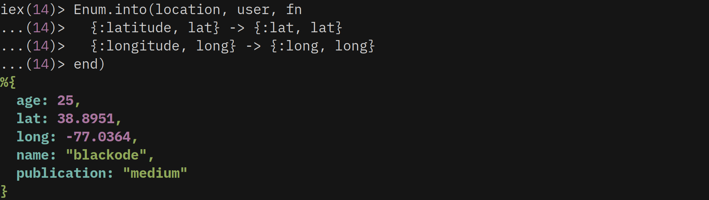
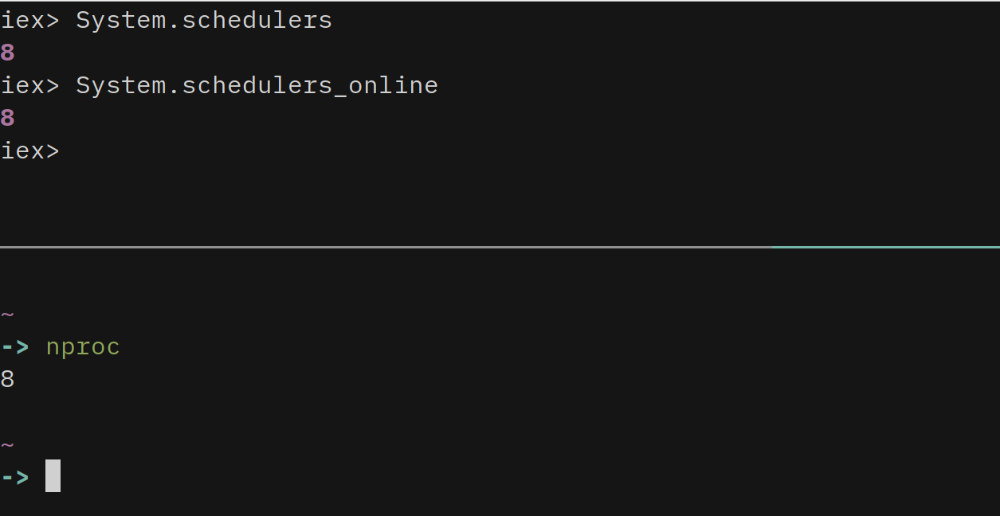
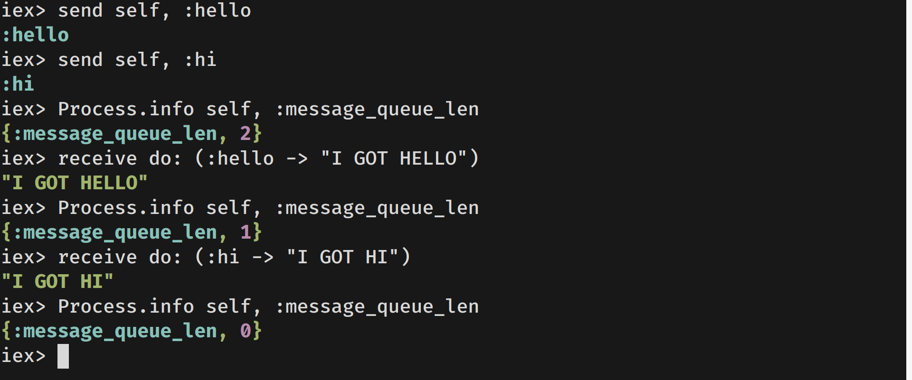
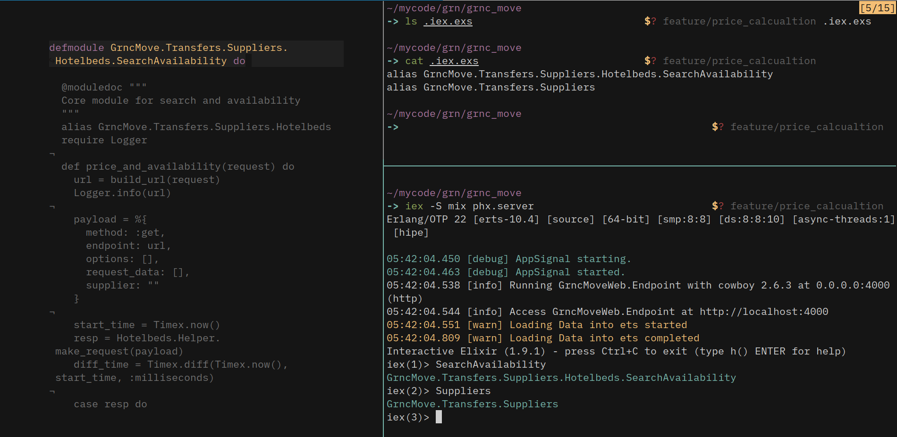

<link rel="stylesheet" href="assets/css/antimony.css" />

# Killer Elixir-Tips
[](#contributors)

Elixir Tips and Tricks from the Experience of Development. 
Each part consists of 10 Unique Tips and Tricks with a clear explanation with live examples and outputs. These tips will speed up your development and save you time in typing code as well.

You can read specific parts with following links...

<div class="elixir-tips-parts">
  <div class="elixir-tips-section">
    <a href="part1.md">
    
    </a>
    <a href="part2.md">
    
    </a>
  </div>

  <div class="elixir-tips-section">
    <a href="part3.md">
    
    </a>
    <a href="part4.md">
    
    </a>
  </div>

  <div class="elixir-tips-section">
   <a href="part5.md">
    
    </a>
    <a href="part6.md">
    
    </a>
  </div>

  <div class="elixir-tips-section">
    <a href="part7.md">
    
    </a>
    <a href="part8.md">
    
    </a>
</div>

  <div class="elixir-tips-section">
    <a href="part9.md">
    
    </a>
</div>

 </div>

 All Photos by [Form](https://unsplash.com/@theformfitness) on [Unsplash](https://unsplash.com)
 
 Checkout some cherry picked tips from the all Parts

# Taste Before you Eat :)

### iex Custom Configuration - iex Decoration

Copy the content into a file and save the file as `.iex.exs` in your `~` home directory and see the magic. You can also download the file [HERE](https://gist.github.com/blackode/5728517116d7a4d08f0a4faddd8c145a)

```elixir
# IEx.configure colors: [enabled: true]
# IEx.configure colors: [ eval_result: [ :cyan, :bright ] ]
IO.puts IO.ANSI.red_background() <> IO.ANSI.white() <> " ❄❄❄ Good Luck with Elixir ❄❄❄ " <> IO.ANSI.reset
Application.put_env(:elixir, :ansi_enabled, true)
IEx.configure(
 colors: [
   eval_result: [:green, :bright] ,
   eval_error: [[:red,:bright,"Bug Bug ..!!"]],
   eval_info: [:yellow, :bright ],
 ],
 default_prompt: [
   "\e[G",    # ANSI CHA, move cursor to column 1
    :white,
    "I",
    :red,
    "❤" ,       # plain string
    :green,
    "%prefix",:white,"|",
     :blue,
     "%counter",
     :white,
     "|",
    :red,
    "▶" ,         # plain string
    :white,
    "▶▶"  ,       # plain string
      # ❤ ❤-»" ,  # plain string
    :reset
  ] |> IO.ANSI.format |> IO.chardata_to_string

)
```


<hr>

### Creating Custom Sigils and Documenting

Each `x` sigil calls its respective `sigil_x` definition

Defining Custom Sigils

```elixir
defmodule MySigils do
  #returns the downcasing string if option l is given then returns the list of downcase letters
  def sigil_l(string,[]), do: String.downcase(string)
  def sigil_l(string,[?l]), do: String.downcase(string) |> String.graphemes

  #returns the upcasing string if option l is given then returns the list of downcase letters
  def sigil_u(string,[]), do: String.upcase(string)
  def sigil_u(string,[?l]), do: String.upcase(string) |> String.graphemes
end
```

#### usage

Load the module into iex

```elixir
iex> import MySigils
iex> ~l/HELLO/
"hello"
iex> ~l/HELLO/l
["h", "e", "l", "l", "o"]
iex> ~u/hello/
"HELLO"
iex> ~u/hello/l
["H", "E", "L", "L", "O"]
```

<hr>

### Custom Error Definitions

#### Define Custom Error

```elixir
defmodule BugError do
   defexception message: "BUG BUG .." # message is the default
end
```

**Usage**

```elixir
iex bug_error.ex

iex> raise BugError
** (BugError) BUG BUG ..
iex> raise BugError, message: "I am Bug.." #here passing the message dynamic
** (BugError) I am Bug..
```
<hr>

### Writing Protocols

#### Define a Protocol

A **Protocol** is a way to dispatch to a particular implementation of a function based on the type of the parameter. The macros `defprotocol` and `defimpl` are used to define Protocols and Protocol implementations respectively for different types in the following example.

```elixir
defprotocol Triple do    
  def triple(input)  
end  

defimpl Triple, for: Integer do    
  def triple(int) do     
    int * 3   
  end  
end   

defimpl Triple, for: List do
  def triple(list) do
    list ++ list ++ list   
  end  
end
```

#### Usage

Load the code into `iex` and execute

```elixir
iex> Triple.triple(3) 
9
Triple.triple([1, 2])
[1, 2, 1, 2, 1, 2]
```
<hr>

### Ternary Operator

There is no ternary operator like `true ? "yes" : "no"` . So, the following is suggested.

```elixir
"no" = if 1 == 0, do: "yes", else: "no"
```
<hr>

### Advantage of Kernel.\|\|

When using pipelines, sometimes we break the pipeline for `or` operation. For example:

```elixir
result = :input
|> do_something
|> do_another_thing
```

```text
# Bad
result = (result || :default_output)
|> do_something_else
```

Indeed, `||` is only a shortcut for `Kernel.||` . We can use `Kernel.||` in the pipeline instead to avoid breaking the pipeline.

The code above will be:

```elixir
result = :input
|> do_something
|> do_another_thing
|> Kernel.||(:default_output)  #<-- This line
|> do_something_else
```

This above tip is from [qhwa](https://medium.com/@qhwa_85848)

<hr>

### Checking Out Code Grouping

Code grouping stands for something great. It shows you how your code is grouped when you write multiple lines of code in single line with out using braces. It will be more clear with the following example.

```elixir
one 1 |> two()
```

If you want to see how this line of code is grouped into, you can check in the following format..

```elixir
quote(do: one 1 |> two()) |> Macro.to_string |> IO.puts
one(1 |> two())
```

So, by using the `quote` and `Macro.to_string` you can see how our code was grouped into.

This tip came out in discussion with the creator of **Ecto** [**MichalMuskala**](https://elixirforum.com/users/michalmuskala) in the Elixir forum.

<hr>

### Elixir Short Circuit Operators && — \|\|

These replaces the nested complicated conditions. These are my best friends in the situations dealing with more complex comparisons. Trust me you gonna love this.

The `||` operator always returns the first expression which is true. Elixir doesn’t care about the remaining expressions, and won’t evaluate them after a match has been found.

#### \|\|

```elixir
false || nil || :blackode || :elixir || :jose
```

Here if you observe the first expression is false next `nil` is also false in elixir next `:blackode` which evaluates to true and its value is returned immediately with out evaluating the `:elixir` and `:jose` . Similarly if all the statements evaluates to `false` the last expression is returned.

#### &&

```elixir
iex> true && :true && :elixir && 5
5
iex> nil && 100
nil
iex> salary = is_login && is_admin && is_staff && 100_000
```

This `&&` returns the second expression if the first expression is `true` or else it returns the first expression with out evaluating the second expression. In the above examples the last one is the situation where we encounter to use the `&&` operator.

<hr>

### Comparing two different data types

I have self experience with this. When I was a novice in elixir, I just compared `"5" > 4` unknowingly by an accident and to my surprise it returned with `true`.

In **Elixir** every term can compare with every other term. So one has to be careful in comparisons.


```elixir
iex> x = "I am x "
"I am x "
iex> x > 34
true
iex> x > [1,2,3]
true
iex> [1, 2, 3] < 1234567890
false
```

**Order of Comparison**

> number &lt; atom &lt; reference &lt; fun &lt; port &lt; pid &lt; tuple &lt; map &lt; list &lt; bitstring \(binary\)

<hr>

### Arithmetic Operators as Lambda functions

When I see this first time, I said to my self “**Elixir is Crazy**”. This tip really saves time and it resembles your smartness. In Elixir every operator is a macro. So, we can use them as lambda functions.

```elixir
iex> Enum.reduce([1,2,3], 0, &+/2)
6
iex> Enum.reduce([1,2,3], 0, &*/2)
0
iex> Enum.reduce([1,2,3], 3, &*/2)
18
iex> Enum.reduce([1,2,3], 3, &-/2)
-1
iex> Enum.reduce([1,2,3], 3, &//2)
0.5
```
<hr>

### Binary Pattern Matching

This is my recent discovery. I always encounter a situation like converting `"$34.56"` which is a string and I suppose do arithmetic operations. I usually do something like this before binary pattern matching..


```elixir
iex> value = "$34.56"
iex ...      |> String.split("$")
iex ...      |> tl
iex ...      |> List.first
iex ...      |> String.to_float
34.56
```

#### Tip Approach

This tip makes my day easy. I recently used this is in one of my projects.

```elixir
iex> "$" <> value = "$34.56"
"$34.56"
iex> String.to_float value  
34.56
```
<hr>

### Must Know the Diffrences of Map keys as :atoms and binary\(strings\)

Before I let you to use this tip, I just want to remind you that **:atoms** are not garbage collected. Atom keys are great! If you have a defined atoms, you are in no danger. What you should not do is converting user supplied input into atoms without sanitizing them first because it can lead to out of memory. **You should also be cautious if you create dynamic atoms in your code.**

But, you can use the `.` to retrieve the data from the keys as `map.key` unlike the usual notation like `map["key"]` . That really saves on typing. But, I don’t encourage this because, as programmers we should really care about memory.


```elixir
iex> map = %{name: "blackode", blog: "medium"}
%{blog: "medium", name: "blackode"}

iex> map.name
"blackode"

iex> map.blog
"medium"
```

Be sure that when you try to retrieve a key with `.` form which is not present in the map, it will raise a **key error** instead of returning the `nil` unlike the `map["key"]` which returns `nil` if `key` is not present in a `map`.

```elixir
iex> map["age"]
nil
```

```text
iex> map.age
Bug Bug ..!!** (KeyError) key :age not found in: %{blog: "medium", name: "blackode"}
Bug Bug ..!!
```

<hr>

### Add Some Color To Your Console Prints

Elixir `>=1.4.0` has **ANSI** color printing option to console. You can have great fun with colors. You can also provide **background colors**.

```elixir
iex> import IO.ANSI
iex> IO.puts red <> "red" <> green <> " green" <> yellow <> " yellow" <> reset <> " normal"
iex> IO.puts Enum.join [red, "red", green, " green", yellow, " yellow", reset, " normal"]
red green yellow normal
```

The red prints in red color, green in green color, yellow in yellow color and normal in white. Have fun with colors…

For more details on color printing check [**Printex**](https://github.com/blackode/printex) module which I created for fun in Elixir.


<hr>

### Functional Macros as Guard Clauses

We cannot make use of the functions as guard clauses in elixir. It means, `when` cannot accept custom defined functions. Consider the following lines of code…

```elixir
defmodule Hello do
  def hello(name, age) when is_kid(age) do
    IO.puts "Hello Kid #{name}"
  end
  
  def hello(name, age) when is_adult(age) do
    IO.puts "Hello Mister #{name}"
  end
  
  def is_kid age do
    age < 12
  end
  
  def is_adult age do
    age > 18
  end
end
```

Here we defined a **module** `Hello` and a function `hello` that takes two parameters of `name` and `age`. So, based on age I am trying `IO.puts`accordingly. If you do so you will get an error saying….

```text
** (CompileError) hello.ex:2: cannot invoke local is_kid/1 inside guard
    hello.ex:2: (module)
```

This is because **when** cannot accept functions as guards. We need to convert them to `macros` Lets do that…

```elixir
defmodule MyGuards do

  defmacro is_kid age do
    quote do: unquote(age) < 12
  end

  defmacro is_adult age do
    quote do: unquote(age) > 18
  end

end
# order of module matters here.....
defmodule Hello do

  import MyGuards

  def hello(name, age) when is_kid(age) do
    IO.puts "Hello Kid #{name}"
  end

  def hello(name, age) when is_adult(age) do
    IO.puts "Hello Mister #{name}"
  end

   def hello(name, age) do
    IO.puts "Hello Youth #{name}"
  end

end
```

In the above lines of code, we wrapped all our guards inside a module `MyGuards` and make sure the module is top of the module `Hello` so, the macros first gets compiled. Now compile and execute you will see the following output..

```elixir
iex> Hello.hello "blackode", 21
Hello Mister blackode
:ok
iex> Hello.hello "blackode", 11
Hello Kid blackode
:ok
```

Starting on Elixir v1.6, you can use [defguard/1](https://hexdocs.pm/elixir/Kernel.html#defguard/1).

The `defguard` is also a macro. You can also create private guards with `defguardp`. Hope, you got the point here.  
Consider the following example.

**NOTE**: The `defguard` and `defguardp` should reside inside the module like other macros. It raises a compile time error, if some thing that don't fit in the guard clause section `when`.

Suppose, you want to check the given number is either `three` or `five`, you can define the guard as following.

```elixir
defmodule Number.Guards do
  defguard is_three_or_five(number) when (number===3) or (number===5)
end
```

#### Usage

```elixir
import Number.Guards
defmodule Hello do
  def check_favorite_number(num) when is_three_or_five(num) do
    IO.puts "The given #{num} is on of my favourite numbers"
  end
  def check_favorite_number(_num), do: IO.puts "Not my favorite number"
end
```

You can also use them inside your code logic as they results `boolean` value.

```elixir
iex> import Number.Guards
Number.Guards

iex> is_three_or_five(5)
true

iex> is_three_or_five(3)
true

iex> is_three_or_five(1)
false
```

Check the following execution screen shot.


<hr>

### Finding whether Module was loaded or not

Sometimes, we have to make sure that certain module is loaded before making a call to the function. We are supposed to ensure the module is loaded.

```text
Code.ensure_loaded? <Module>
```

```elixir
iex> Code.ensure_loaded? :kernel
true
iex> Code.ensure_loaded :kernel
{:module, :kernel}
```

Similarly we are having `ensure_compile` to check whether the module is compiled or not…

<hr>

### Converting Binary to Capital Atom

Elixir provides a special syntax which is usually used for module names. What is called a module name is an _**uppercase ASCII letter**_ followed by any number of _lowercase_ or _uppercase ASCII letters_, _numbers_, or _underscores_.

This identifier is equivalent to an atom prefixed by `Elixir.` So in the `defmodule Blackode` example `Blackode` is equivalent to `:"Elixir.Blackode"`

When we use `String.to_atom "Blackode"` it converts it into `:Blackode` But actually we need something like “**Blackode” to Blackode**. To do that we need to use `Module.concat`

```elixir
iex(2)> String.to_atom "Blackode"
:Blackode
iex(3)> Module.concat Elixir,"Blackode"
Blackode
```

In Command line applications whatever you pass they convert it into **binary**. So, again you suppose to do some casting operations …

<hr>

### Pattern match \[ vs \] destructure.

We all know that `=` does the pattern match for left and right side. We cannot do `[a, b, c] = [1, 2, 3, 4]` this raise a `MatchError`

```elixir
iex(11)> [a, b, c] = [1, 2, 3, 4]
** (MatchError) no match of right hand side value: [1, 2, 3, 4]
```

We can use `destructure/2` to do the job.

```elixir
iex(1)> destructure [a, b, c], [1, 2, 3, 4]
[1, 2, 3]
iex(2)> {a, b, c}
{1, 2, 3}
```

If the left side is having more entries than in right side, it assigns the `nil` value for remaining entries..

```elixir
iex> destructure([a, b, c], [1])
iex> {a, b, c} 
{1, nil, nil}
```

<hr>

### The Goodness of Data decoration \[ inspect with :label \] option

We can decorate our output with `inspect` and `label` option. The string of `label` is added at the beginning of the data we are inspecting.

```elixir
iex(1)> IO.inspect [1, 2, 3], label: "the list "
the list : [1, 2, 3]
[1, 2, 3]
```

If you closely observe this it again returns the inspected data. So, we can use them as intermediate results in `|>` pipe operations like following……

```elixir
[1, 2, 3] 
|> IO.inspect(label: "before change") 
|> Enum.map(&(&1 * 2)) 
|> IO.inspect(label: "after change") 
|> length
```

You will see the following `output`

```text
before change: [1, 2, 3]
after change: [2, 4, 6]
3
```
<hr>

### Piping Anonymous functions

We can pass the anonymous functions in two ways. One is directly using `&`like following..

```elixir
[1, 2, 3, 4, 5]
|> length()
|> (&(&1*&1)).()
```

This is the most weirdest approach. How ever, we can use the reference of the anonymous function by giving its name.

```elixir
square = & &1 * &1
[1, 2, 3, 4, 5]
|> length()
|> square.()
```

The above style is much better than previous . You can also use `fn` to define anonymous functions.

<hr>

### Retrieve Character Integer Codepoints — ?

We can use `?` operator to retrieve character integer codepoints.

```elixir
iex> ?a
97
iex> ?#
35
```

The following two tips are mostly useful for beginners…

<hr>

### Performing Subtraction on Lists

We can perform the subtraction over lists for removing the elements in list.

```elixir
iex> [1, 2, 3, 4.5] -- [1, 2]
[3, 4.5]
iex> [1, 2, 3, 4.5, 1] -- [1]  
[2, 3, 4.5, 1]
iex> [1, 2, 3, 4.5, 1] -- [1, 1]
[2, 3, 4.5]
iex> [1, 2, 3, 4.5] -- [6]
[1, 2, 3, 4.5]
```

We can also perform same operations on char lists too..

```elixir
iex(12)> 'blackode' -- 'ode'
'black'
iex(13)> 'blackode' -- 'z'    
'blackode'
```

If the element to subtract is not present in the list then it simply returns the list.

<hr>

### Running Multiple Mix Tasks

```elixir
mix do deps.get,compile
```

You can run multiple tasks by separating them with coma `,`

How ever you can also create aliases in your mix project in a file called `mix.exs` .

The project definition looks like the following way when you create one using a `mix` tool.

```elixir
def project do
    [app: :project_name,
     version: "0.1.0",
     elixir: "~> 1.4-rc",
     build_embedded: Mix.env == :prod,
     start_permanent: Mix.env == :prod,
     deps: deps()]
  end
```

You are also allowed to add some extra fields…

Here you have to add the `aliases` field.

```elixir
[
 aliases: aliases()
]
```

Don’t forget to add `,` at the end when you add this in the middle of `list` .

The `aliases()` should return the `key-value` list.

```elixir
defp aliases do
  [
    "ecto.setup": ["ecto.create", "ecto.migrate", "ecto.seed"]
  ]
end
```

So, whenever you run the `mix ecto.setup` the three tasks `ecto.create`, `ecto.migrate` and `ecto.seed` will run one after the other.

You can also add them directly as following unlike I did with private function.

```elixir
def project do
    [app: :project_name,
     version: "0.1.0",
     aliases: ["ecto.setup": ["ecto.create", "ecto.migrate", "ecto.seed"]]      
.....
  end
```

<hr>

### Accessing the Documentation

Elixir stores the documentation inside the `bytecode` in a memory. You access the documentation with the help of `Code.get_docs/2` function . This means, the documentation accessed when it is required, but not when it is loaded in the virtual machine like `iex`

Suppose you defined a module in memory like ones you defined in **IEx**, cannot have their documentation accessed as they do not have their bytecode written to disk.

Let us check this…

Create a module with name `test.ex` with the following code. You can copy and paste it.

```elixir
defmodule Test do
  @moduledoc """
  This is the test module docs
  """

  @doc """
  This is the documentation of hello function
  """
  def hello do
    IO.puts "hello"
  end
end
```

Now stay in the directory where your file exists and run the command

```elixir
$ iex test.ex
```

Now you can access the function definitions but not the documentation.

```elixir
iex> Test.hello
hello
:ok
```

That means the code is compiled but documentation is not stored in the memory. So, you cannot access the docs. Lets check that…

```elixir
iex> Code.get_docs Hello, :moduledoc
nil
```

You will see the output as `nil` when you are trying to access the **docs** of the module you have created so far. This is because, the `bytecode` is not available in disk. In simple way `beam` file is not present. Lets do that...

Press `Ctrl+C` twice so you will come out of the shell and this time you run the command as

```elixir
$ elixirc test.ex
```

After running the command, you will see a file with name `Elixir.Test.beam` . Now the `bytecode` for the module `Test` is available in memory. Now you can access the documentation as follows...

```elixir
$ iex
iex> Code.get_docs Test, :moduledoc
{3, "This is the test module docs\n"}
```

The output is tuple with two elements. The first element is the line number of the documentation it starts and second element is the actual documentation in the binary form.

You can read more about this function [here](https://hexdocs.pm/elixir/Code.html#get_docs/2)

<hr>

### Dynamic Function Name in Elixir Macro

The hack is name of a function should be an **atom** instead of binary.

```elixir
defmacro gen_function(fun_name) do
  quote do 
    def unquote(:"#{fun_name}")() do
      # your code...
    end
  end
end
```

<hr>

### Printing List as List without ASCII-Encoding

You know that when the list contains all the numbers as **ASCII** values, it will list out those values instead of the original numbers. Lets check that…

```elixir
iex> IO.inspect [97, 98]
'ab'
'ab'
```

The code point of `a` is `97` and `b` is `98` hence it is listing out them as `char_list`. However you can tell the `IO.inspect` to list them as list itself with option `char_lists: :as_list` .

```elixir
iex> IO.inspect [97, 98], charlists: :as_lists
[97, 98]
'ab'
```

Open `iex` and type `h Inspect.Opts`, you will see that Elixir does this kind of thing with other values as well, specifically **structs** and **binaries**.

<hr>

### Fetching out file name and line number the expression is on

```elixir
defmacro __ENV__()
```

This macro gives the current environment information. You can get the information like current `filename` `line` `function` and others…

```elixir
iex(4)> __ENV__.file
"iex"

iex(5)> __ENV__.line
5
```
<hr>

### Creating Manual Pids for Unit Testing

You can create the pid manually in Elixir with `pid` function. This comes with two flavors.

#### def pid\(string\)

Creates the pid from the string.

```elixir
iex> pid("0.21.32")
#PID<0.21.32>
```

#### def pid\(a, b, c\)

Creates a **PID** with 3 non negative integers passed as arguments to the function.

```elixir
iex> pid(0, 21, 32)
#PID<0.21.32>
```

#### Why do you create the pids manually?

Suppose, you are writing a library and you want to test one of your functions for the type `pid`, then you can create one and test with it.

You cannot create the pid like assigning `pid = #PID<0.21.32>` because `#` is considered as comment here.

```elixir
iex(6)> pid = #PID<0.21.32>
...(6)>
```

When you do like above, **iex** shell just wait for more input as `#PID<0.21.32>` is treated as comment.

Now you enter another data to complete the expression. The entered value is the value of the pid. Lets check that…

```elixir
iex(6)> pid = #PID<0.21.32>      # here expression is not complete
...(6)> 23    # here we are giving the value 23
23            # expression is complete
iex(7)> pid
23
```
<hr>

### Replacing the String with global option

The `String.replace` function will replace the given the pattern with replacing pattern. By default, it replaces all the occurrences of the pattern. Lets check that…

```elixir
iex(1)> str = "hello@hi.com, blackode@medium.com"    
"hello@hi.com, blackode@medium.com"

iex(2)> String.replace str,"@","#"
"hello#hi.com, blackode#medium.com
```

The `String.replace str, "@", "#"`is same as `String.replace str, "@", "#", global: true`

But, if you want to replace only the first occurrence of the pattern, you need to pass the option `global: false` . So, it replaces only the first occurrence of `@` . Lets check that…

```elixir
iex(3)> String.replace str, "@", "#", global: false
"hello#hi.com, blackode@medium.com"
```

Here only first `@` is replaced with `#`.

<hr>

### Memory Usage

You can check the memory usage \(in bytes\) with `:erlang.memory`

```elixir
iex(1)> :erlang.memory
[total: 16221568, processes: 4366128, processes_used: 4364992, system: 11855440,
 atom: 264529, atom_used: 250685, binary: 151192, code: 5845369, ets: 331768]
```

However, you can pass option like `:erlang.memory :atom` to get the memory usage of atoms.

```elixir
iex(2)> :erlang.memory :atom
264529
```

<hr>

### Picking out the elements in List

We all know that a proper list is a combination of `head` and `tail` like `[head | tail]` . We can use the same principle for picking out the elements in the list like the following way…

```elixir
iex> [first, second, third, fourth | _rest] = [1, 2, 3, 4, 5, 6, 7]
[1, 2, 3, 4, 5, 6, 7]
iex> first
1
iex> {second, third, fourth}
{2, 3, 4}
```

<hr>

### The combination effect of get\_in /Access.all\(\)

We all know that the get\_in function is used to extract the key which is deeper inside the map by providing the list with keys like a following way…

```elixir
iex> user = %{"name" => {"first_name" => "blackode", "last_name" => "john" }}
%{"name" => %{"first_name" => "blackode", "last_name" => "john"}}
iex > get_in user, ["name", "first_name"]
"blackode"
```

But, if there is a list of maps `[maps]` where you have to extract `first_name` of the each map, generally we go for `enum` . We can also achieve this by using the `get_in` and `Access.all()`

```elixir
iex> users=[%{"user" => %{"first_name" => "john", "age" => 23}},
            %{"user" => %{"first_name" => "hari", "age" => 22}},
            %{"user" => %{"first_name" => "mahesh", "age" => 21}}]
# that is a list of maps 
iex> get_in users, [Access.all(), "user", "age"]
[23, 22, 21]

iex> get_in users, [Access.all(), "user", "first_name"]
["john", "hari", "mahesh"]
```

**Note:** If the key is not present in map, then it returns nil **Warning:** When you use the `get_in` along with `Access.all()` , as the first value in the list of keys like above, the users datatype should be list. If you pass the map, it returns the error.

```elixir
iex(17)> list = [%{name: "john"}, %{name: "mary"}, %{age: 34}]
[%{name: "john"}, %{name: "mary"}, %{age: 34}]
iex(18)> get_in(list, [Access.all(), :name])
["john", "mary", nil]
```

In the above lines of code returns the `nil` for key which is not in the `map`.

```elixir
iex(19)> get_in(%{name: "blackode"}, [Access.all(), :name])
** (RuntimeError) Access.all/0 expected a list, got: %{name: "blackode"}
    (elixir) lib/access.ex:567: Access.all/3
```

In the above lines of code returns the error for passing map .

However, you can change the position of the Access.all\(\) in the list. But the before key should return the list. Check the following lines of code.

**Deep Dive**

We can also use the Access.all\(\) with functions like update\_in, get\_and\_update\_in, etc..  
For instance, given a user with a list of books, here is how to deeply traverse the map and convert all book names to uppercase:

```elixir
iex> user = %{name: "john", books: [%{name: "my soul", type: "tragedy"}, %{name: "my heart", type: "romantic"}, %{name: "my enemy", type: "horror"}]}
iex> update_in user, [:books, Access.all(), :name], &String.upcase/1
%{books: [%{name: "MY SOUL", type: "tragedy"}, %{name: "MY HEART", type: "romantic"}, %{name: "MY ENEMY", type: "horror"}], name: "john"}
iex> get_in user, [:books, Access.all(), :name]
["my soul", "my heart", "my enemy"]
```

Here, user is not a list unlike in the previous examples where we passed the users as a list. But, we changed the position of `Access.all()` and inside the list of keys `[:books, Access.all(), :name]`, the value of the key `:books` should return the list, other wise it raises an error.

<hr>

### Data Comprehension along with filters using FOR

We achieve the data comprehension through `for x <- [1, 2, 3], do: x + 1` . But we can also add the comprehension along with filter.

**General Usage**

```elixir
iex> for x <- [1, 2, 3, 4], do: x + 1
[2, 3, 4, 5]
# that is how we use in general lets think out of the box
```

**With filters**

Here I am using two lists of numbers and cross product over the lists and filtering out the product which is a odd number.

```elixir
iex> for x <- [1, 2, 3, 4], y <- [5, 6, 7, 8], rem(x * y, 2) == 0, do: {x, y, x * y}
[{1, 5, 5}, {1, 7, 7}, {3, 5, 15}, {3, 7, 21}]
#here rem(x * y, 2) is acting as a filter.
```

<hr>

### Comprehension with binary strings.

Comprehension with binary is little different. You supposed to wrap inside `<<>>`

Lets check that…

```elixir
iex> b_string = <<"blackode">>
"blackode"
iex> for << x <- b_string >>, do: x + 1
'cmbdlpef'
#here it is printing out the letter after every letter in the "blackode"
```

Did you observe that `x <- b_string` is just changed something like `<< x <- b_string >>` to make the sense.

<hr>

### Advanced Comprehension IO.stream

Here we are taking the elixir comprehension to the next level.  
We read the input from the keyboard and convert that to upcase and after that it should wait for another entry.

```elixir
for x <- IO.stream(:stdio, :line), into: IO.stream(:stdio, :line), do: String.upcase(x)
```

Basically `IO.stream(:stdio, :line)` will the read a line input from the keyboard.

```elixir
iex> for x <- IO.stream(:stdio, :line), into: IO.stream(:stdio, :line), do: String.upcase(x)
hello
HELLO
hi
HI
who are you?
WHO ARE YOU?
blackode
BLACKODE
^c ^c # to break
```
<hr>

### Single Line Multiple module aliasing

We can also alias multiple modules in one line:

```elixir
alias Hello.{One,Two,Three}

#The above line is same as the following 
alias Hello.One
alias Hello.Two
alias Hello.Three
```
<hr>

### Importing Underscore Functions from a Module

By default the functions with \_ are not imported. However, you can do that by importing them with `:only` explicitly.

```elixir
import File.Stream, only: [__build__: 3]
```
<hr>

### Extracting Project Information

```elixir
Mix.Project.config[:version] # returns the version
Mix.Project.config[:app] # returns app name
```

You have to be inside the `mix project` when you are trying. See this in action… [](https://asciinema.org/a/g75QG1GmKR1Ret0PMThjxDd8u)

<hr>

### Inner Binary Representation of String

This is a common trick in `elixir` . You have to concatenate the null byte `<<0>>` to a string that you want to see its inner binary representation like in the following way…

```elixir
iex> “hello” <> <<0>>
<<104, 101, 108, 108, 111, 0>>
```
<hr>

### Multiple Bindings of a value

```elixir
iex> x = y = z = 5
5
iex> x
5
iex> y
5
iex> z
5
```

See this in action here...

[](https://asciinema.org/a/135066)

<hr>

### Not Null implementation in Structs

This is much like adding a not null constraint to the structs. When you try to define the struct with the absence of that key in the struct, it should raise an exception. Lets do that…  
You have to use `@enforce_keys [<keys>]` while defining the struct…

```elixir
# Defining struct
defmodule Employee do
   @enforce_keys [:salary]
   defstruct name: nil, salary: nil
end
# Execution 
iex> employee = %Employee{name: "blackode"} # Error 
iex> employee = %Employee{name: "blackode",salary: 12345}
%Employee{name: "john", salary: 12345}
```

See this in action... [](https://asciinema.org/a/dYmXUDeUoQ2gneSwM7tiIhbNE)

**Warning** Keep in mind `@enforce_keys` is a simple compile-time guarantee to aid developers when building structs. It is not enforced on updates and it does not provide any sort of value-validation. The above warning is from the [ORIGINAL DOCUMENTATION](https://hexdocs.pm/elixir/Kernel.html#defstruct/1-enforcing-keys)

<hr>

### Check Whether Function is Exported or not

Elixir provides `function_exported?/3` to achieve this…

```elixir
# Defining the module with one exported function and private one
defmodule Hello do
  def hello name do
   IO.puts name
  end
  defp hellop name do
    IO.puts name 
  end
end
# Execution Copy and paste above lines of code in iex> 
iex> function_exported? Hello, :hello,1
true
iex> function_exported? Hello, :hellop, 1
false
```

See this in action... [](https://asciinema.org/a/135080)

<hr>

### Splitting the string with multiple Patterns

We all know how to split a string with `String.split/2 function`. But you can also pass a **pattern** to match that over and over and splitting the string whenever it matches the **pattern**.

```elixir
"Hello Blackode! Medium-is-5*"
```

If you observe the above string, it comprises of **two blank spaces** , **one exclamation mark** `!` , **two minus — symbols** `-` and a **asterisk** `*` symbol. Now we are going to split that string with all of those.

```elixir
string = "Hello Blackode! Medium-is-5*"
String.split string, [" ", "!", "-", "*"]
#output
["Hello", "Blackode", "", "Medium", "is", "5", ""]
```

The pattern is generated at run time. You can still validate with `:binary.compiled`

<hr>

### Checking the closeness of strings

You can find the distance between the two strings using `String.jaro_distance/2`. This gives a float value in the range `0..1` Taking the `0` for no close and `1` is for exact closeness.

```elixir
iex> String.jaro_distance "ping", "pong"
0.8333333333333334

iex> String.jaro_distance "color", "colour"
0.9444444444444445
iex> String.jaro_distance "foo", "foo"
1.0
```

For the **FUN**, you can find your closeness with your name and your partner or lover in case if aren’t married. Hey… ! I am just kidding…. It is just an algorithm which is predefined where our love is undefined. Cheers …….. :\)

<hr>

### Executing code Immediately after loading a Module

Elixir provides `@on_load` which accepts `atom` as function name in the same module or a `tuple` with function\_name and its arity like `{function_name, 0}`.

```elixir
#Hello module 
defmodule Hello do
@on_load :onload     # this executes after module gets loaded 
  def onload do
    IO.puts "#{__MODULE__} is loaded successfully"
  end
end
# Execution .... Just copy and paste the code in the iex terminal
# You will see the output something like this ....
Elixir.Hello is loaded successfully  
{:module, Hello,
 <<70, 79, 82, 49, 0, 0, 4, 72, 66, 69, 65, 77, 65, 116, 85, 56, 0, 0, 0, 130,
   0, 0, 0, 12, 12, 69, 108, 105, 120, 105, 114, 46, 72, 101, 108, 108, 111, 8,
   95, 95, 105, 110, 102, 111, 95, 95, 9, ...>>, {:onload, 0}}
```

You can see this in live here… [](https://asciinema.org/a/GGmD9jUuRQQNherMh3fY5Zn4e)

<hr>

### Chain of \[ or \] ’ s  in guard clauses with when

This is about multiple guards in the same clause and writing `or` conditions with out using `or` We all know that `or` is used as a conjunction for two conditions resulting true if either one of them is true. Many of us writing the or conditions in the guard as following way…

```elixir
def print_me(thing) when is_integer(thing) or is_float(thing) or is_nil(thing), do: "I am a number"
```

You can also do this in bit more clear format as the following way…

```elixir
def print_me(thing)
  when is_integer(thing)
  when is_float(thing)
  when is_nil(thing) do
 "I am a number "
end
```

See this in action… [](https://asciinema.org/a/S64h7ydwzfMXsPgOeSfcRXejA)

See also [Elixir Style Guide](https://github.com/christopheradams/elixir_style_guide)

<hr>

### Prett Printing of a quoted Expression

#### Macro.to\_string \|&gt; IO.puts

In general, when you pass the quote expression to `Macro.to_string` , it returns the actual code in a string format and we all knew this.

The weird thing is, it gives the output in a single line along with **\n** characters inside the string.

Check it down

```elixir
    iex(2)> q = quote do
    ...(2)> 1+2
    ...(2)> name = "blackode"
    ...(2)> end

    {:__block__, [],
     [
       {:+, [context: Elixir, import: Kernel], [1, 2]},
       {:=, [], [{:name, [], Elixir}, "blackode"]}
     ]}

    iex(3)> Macro.to_string q
    "(\n  1 + 2\n  name = \"blackode\"\n)"
```

To print the new lines, you pipe the string output from `Macro.to_string` to `IO.puts` like in the following code snippet. It gives the clean output by printing in new line.

```elixir
    iex(4)> Macro.to_string(q) |> IO.puts
    (
      1 + 2
      name = "blackode"
    )
    :ok
```


#### Check this in live

[](https://asciinema.org/a/161913)

<hr>

### Finding the loaded files in iex and dynamic loading files on-fly

1. **Finding the loaded files**

#### Code.loaded\_files

In elixir, we are having a definition `loaded_files` in the module `Code` used to find the loaded files.

Let’s see this.

Run the command `iex` inside your terminal and call the function `Code.loaded_files` .

It gives an empty list `[]` as output because we haven’t loaded any files so far.

```elixir
    $ iex
    iex> Code.loaded_files
    []
```

<hr>

#### File Loading

Let’s create a file `hello.ex` with a single function definition `hello` which just prints a string **“Welcome to the world”** for the demo purpose.

```elixir
    # hello.ex

    defmodule Hello do
      def hello do
        IO.puts "Welcome to the world"
      end
    end
```

Save the file after editing.

Now, make sure you are in the same directory of where the file exists and run the command

```elixir
    $ iex hello.ex
```

It opens the **Elixir** interactive shell by loading the `hello.ex` file as well.

Now, you can see the loaded file by calling `Code.loaded_files` . It outputs the path to the file.

```elixir
    iex> Code.loaded_files
    ["/home/john/hello.ex"]
```

That is one way of loading files. You can also load them on-fly in `iex session`

<hr>

#### Dynamic loading on-fly

**Code.load\_file/1**

Unlike loading files with `iex hello.ex` , you can load them on-fly in `iex`session with the help of `Code.load_file "path/to/file"` .

Let us assume that we have a file `hello.ex` in our current directory and open `iex` session from the same directory.

```elixir
    $ iex

    iex> Code.load_file "hello.ex"
    [
      {Hello,
       <<70, 79, 82, 49, 0, 0, 4, 72, 66, 69, 65, 77, 65, 116, 85, 56, 0, 0, 0, 140,
         0, 0, 0, 15, 12, 69, 108, 105, 120, 105, 114, 46, 72, 101, 108, 108, 111,
         8, 95, 95, 105, 110, 102, 111, 95, 95, 9, ...>>}
    ]
```

#### Let's check this in action

[](https://asciinema.org/a/161920)

<hr>

### Making Providing deprecation reason 

**@deprecated**

You might be noticed the warnings of using deprecated functions in a library along with some useful hint text. Today, we build this from scratch.

Suppose, you have written a library and want to update the name of one function in your next build release and if the user tried to access the old function then you have to warn him of using deprecated function instead of updated one.

To see this in action, you need to create new mix project.

Let’s do that.

```elixir
    mix new hello
```

Next change the directory to the project created.

```elixir
    cd hello
```

Now, edit the file `lib/hello.ex` in the project with the following code

```elixir
    #lib/hello.ex

    defmodule Hello do
      def hello do 
        Printee.print()
      end
    end

    defmodule Printee do

      @deprecated "print/0 is deprecated use show/0" 
      def print do
        IO.puts "hello blackode"
      end

      def show do
        IO.puts "hello blackode"
      end

    end
```


This file comprises of two modules `Hello` and `Printee` . The `Printee` module comprises of two functions `print/0` and `show/0` . Here purposely, `print/0` is considered as a deprecated function used inside the `Hello` module.

The mix compiler automatically looks for calls to deprecated modules and emit warnings during compilation.

So, when you compile the project `mix compile`, it gives a warning saying

> **“print/0 is deprecated use show/0”**

like in the following screenshot.

 Deprecated Function Warning


#### Check the live coding

[](https://asciinema.org/a/161939)


<hr>

### Module Creation with create function

#### Module.create/3

As we all know `defmodule` is used to create a module. In similar, `Module.create/3` is also used to create a module.

The only difference in defining a module with `Module.create/3` is the definition inside the module is quoted expression.

However, we can use the help of `quote` to create a quoted expression.

We have to pass three parameters to `Moduel.create` .

The first one is **name** of the module. The second one is module definition in quoted expression. The third one is location. The location is given in `keyword list` like `[file: String.t, line: Integer ]` or else you can just take the help of `Macro.Env.location(__ENV__)` which returns the same.


location of loc

```elixir
    iex> module_definition = quote do: def hello, do: IO.puts "hello"
```

The above line of code gives the context of the module definition and collected in `module_definition` . We can use this `module_defintion` to pass as second parameter to `Module.create/3` function.

 module definition context


Let’s put all together and see the magic

```elixir
    iex(8)> Module.create Hello, module_definition, [file: "iex", line: 8 ]
```


Creating another module `Foo` with same module function

```elixir
    iex(10)> Module.create Foo, module_definition, Macro.Env.location(__ENV__)
```


#### Check out the live execution

[](https://asciinema.org/a/162255)

<hr>

### Finding the list of bound values in iex

#### binding

```elixir
    iex> binding
    []
    
    iex> name = "blackode"
    "blackode"
    
    iex> blog = "medium"
    "medium"
    
    iex> binding
    [blog: "medium", name: "blackode"]
```


This is used in debugging purpose inside the function.

It is also very common to use `IO.inspect/2` with `binding()`, which returns all variable names and their values:

```elixir
def fun(a, b) do
  IO.inspect binding()
  ...
end
```

When `fun/2` is invoked with `:laughing`, `"time"` it prints:

```elixir
[a: :laughing, b: "time"]
```

You can also give context to the `binding`

If the given context is **nil \***\(by default it is\), \*the binding for the current  
 context is returned.

```elixir
    iex> var!(x, :foo) = 1
    1
    iex> binding(:foo)
    [x: 1]
```

#### Check out the live execution

[](https://asciinema.org/a/162257)

<hr>

### Fun with Char\_Lists

We can convert any integer to charlist using `Integer.char_list` . It can be used in two ways either passing the base the base value or not passing.

Let’s try with base and with out base.

#### without base

```elixir
    iex> Integer.to_charlist(882681651)
    '882681651'
```

#### with base

```elixir
    iex> Integer.to_charlist(882681651, 36)
    'ELIXIR'
```

Try your own names as well and find your value with base

```elixir
    iex> List.to_integer 'BLACKODE', 36
    908344015970

    iex> Integer.to_charlist(908344015970, 36)
    'BLACKODE'
```
<hr>

### Universal Code base formatter

Code formatting is easy now with the help of mix task `mix format`. It will take care of all you care about cleaning and refactoring as well. It can assure a clean code base or simply universal code base which maintains some useful standards. This really saves a lot of time.

```elixir
    mix format filename
```

To know more about the codebase formatting, check out my recent article on

#### \[Code Formatter The Big Feature in Elixir

1.6\]\([https://medium.com/blackode/code-formatter-the-big-feature-in-elixir-v1-6-0-f6572061a4ba](https://medium.com/blackode/code-formatter-the-big-feature-in-elixir-v1-6-0-f6572061a4ba)\)

which explains all about using `mix format` task and its configuration in detail with screen shots of vivid examples.

<hr>

### Replacing a Key in Map

I know, you might be thinking why some one would do that. I too had the same feeling until I met with a requirement in one of my previous projects where I was asked to replace `address1` with `address` and some other keys as well. It is a huge one. I have to do change many keys as well.

I’m here with a simple `map` to keep it understandable. But, the technique is same.

> The thing to remember is; be smart and stay long;

```elixir
details = %{name: "john", address1: "heaven", mobile1: "999999999"}
```

The above map comprises of **two** weird keys address1 and mobile1 where we do workout on to take over them.

```elixir
iex> details = %{name: "john", address1: "heaven", mobile1: "999999999"}
%{address1: "heaven", mobile1: "999999999", name: "john"}

iex> Map.new(details, fn  
  {:address1, address} -> {:address, address}
  {:mobile1, mobile} -> {:phone, mobile} 
  x -> x 
end)

%{address: "heaven", name: "john", phone: "999999999"} #output
```

#### What’s the magic here❓

Nothing , just pattern\_matching, the boon for functional programmers. The magic lies inside Map.new and the **anonymous** function where we used our **magic band** to see the actual **logic**.


## Filtering With match?

As we know, `Enum.filter` will do the job based on the evaluation of a condition. But still, we can use the **pattern** to **filter** things.

Let me make you clear with the following example.

I have a list of **users** where their names are mapped to their preferred programming language.

```elixir
iex> user_and_programming_languages = 
 %{john: "elixir", latha: "elixir", hari: "erlang", toy: "perl"}

%{hari: "erlang", john: "elixir", latha: "elixir", toy: "perl"}
```

Like above, the **user\_names** are mapped with their **languages**. Now, our job is to filter the _**users**_ of **elixir** language.

Just let me know which one you do prefer after checking out the following…

```elixir
iex> user_and_programming_languages |>
Enum.filter(fn {_, lang} -> lang=="elixir" end )

[john: "elixir", latha: "elixir"]  
#output
```

OR, using match? for pattern based

```elixir
user_and_programming_languages = 
 %{john: "elixir", latha: "elixir", hari: "erlang", toy: "perl"}

user_and_programming_languages |>
Enum.filter(&match?({_, "elixir"}, &1) )

[john: "elixir", latha: "elixir"]  
#output
```

Checkout the screenshots of _evaluation_


I took the simpler lines of code to give a demo of using match? but, it’s usages are limit less. Just think about the **pattern** and match over it. Think out of the box guys. But don’t blow up your mind and don’t blame me for that.

**Warning: ⚠️**

Make sure of your **pattern** as the **first** parameter to the match? otherwise, you have to pay for the compiler. Just kidding 😃

```elixir
iex> user_and_programming_languages |>
Enum.filter(&match?(&1, {_, "elixir"},) )
```


<hr>

### Bangpipe &lt;\|&gt; Left and Right

As we know elixir is free language, where you can build anything you need. But, be careful It is just to show you something is achievable.

It is a **LEFT** and **RIGHT** Pipe

We usually end up with some sort of results in the format {:ok, result} . This can be found anywhere in your project sooner or later.

If you pipe it to the function obviously you will end up with an unknown expectation. I am talking about run-time errors. Our \|&gt; is not smart enough to check it for whether is a direct result or {:ok, result} .

Let’s build it for the **GOD** sake but not for your **client**.

⚠️ _**Don’t use this ever and don’t do write macros until you write new framework.**_

```elixir
iex> defmodule Bangpipe do
  defmacro left <|> right do
    quote do
      unquote(left)
      |> case do
        {:ok, val} -> val 
        val -> val
      end
      |> unquote(right)
    end
  end
end
```

This Bangpipe I mean &lt;\|&gt; is defined to do the task. Before sending the result to the function in right, it is performing the pattern matching over the result to identify what kinda result it is. I hope you understood what actually the result I am talking about. [**The Secret behind Elixir Operator Re-Definitions : + to -** \*Just for Fun](https://medium.com/blackode/the-secret-behind-elixir-operator-overriding-to-a564fd6c0dd6)\*

We can also do re definitions on elixir operators. Check above URL.

How to use ❓

Just import **Bangpipe** the left-right pipe will be loaded. Copy and paste to experience it in live and fast into iex

```elixir
iex[6]  import Bangpipe
Bangpipe

iex[7]  data = {:ok, [1,2,3,4,5]} 
{:ok, [1, 2, 3, 4, 5]}

iex[8]  data <|> length
5
```

> “Good programmers write the code & great programmers steal the code” This tip is copied from the [Elixir Lightening Talk](https://www.youtube.com/watch?v=2vocLGYFj8Q&t=25s)

**\*Bangpipe** **&lt;\|&gt;** **execution\***


<hr>

### Finding the function callers in a project.

_Let’s create a brief story here._

The moment when GOD’S against you, your manager will come and give you a vast legacy project code and asked you to find out _**all the places where a particular function**_ is called. In a sentence, the **callers** of a particular function.

**What will you do?** I don’t think it is a smart way of surfing in each and every file. I don’t. So, you don’t.

```elixir
mix xref callers Module.function

example

mix xref callers Poison.decode
```

Prints all callers of the given **CALLEE**, which can be one of: **Module**, **Module.function**, or **Module.function/arity**.

### Examples:

```elixir
mix xref callers ***Module***
mix xref callers ***Module.fun***
mix xref callers ***Module.fun/3***
```

_mix xref callers Poison.decode_


You can add function arity to be more specific, in this case mix xref callers Poison.decode/1 .

**BOOM !** Now, you can surprise the manager with results before he reaches his cabin. Be fast and smart.

I solely experienced this when my co-worker I better say **co-programmer** asked for help regarding the situation but there's no manager in my case.

Explore more about **xref**

```elixir
mix help **xref**
```
<hr>

### Using Enum.group_by beyohnd Grouping of things

I have a collection of hotel\_bookings and I need to group them based on their booking status.

To keep this simple, I am just using some false random collection.

```elixir
iex> hotel_bookings = [ 
%{name: "John", country: "usa", booking_status: :success},
%{name: "Hari", country: "india", booking_status: :fail},
%{name: "Mahesh", country: "austria", booking_status: :pending},
%{name: "Ruchi", country: "paris", booking_status: :success},
%{name: "Nitesh", country: "malasia", booking_status: :success},
%{name: "Manoj", country: "japan", booking_status: :fail},
%{name: "Akhilesh", country: "china", booking_status: :pending},
%{name: "Rajesh", country: "india", booking_status: :fail},
%{name: "Payal", country: "london", booking_status: :success},
%{name: "Kumar", country: "france", booking_status: :fail}
]
```

Let’s group the things.

```elixir
iex> Enum.group_by(hotel_bookings, &Map.get(&1, :booking_status))
%{
  fail: [
    %{booking_status: :fail, country: "india", name: "Hari"},
    %{booking_status: :fail, country: "japan", name: "Manoj"},
    %{booking_status: :fail, country: "india", name: "Rajesh"},
    %{booking_status: :fail, country: "france", name: "Kumar"}
  ],
  pending: [
    %{booking_status: :pending, country: "austria", name: "Mahesh"},
    %{booking_status: :pending, country: "china", name: "Akhilesh"}
  ],
  success: [
    %{booking_status: :success, country: "usa", name: "John"},
    %{booking_status: :success, country: "paris", name: "Ruchi"},
    %{booking_status: :success, country: "malasia", name: "Nitesh"}, 
    %{booking_status: :success, country: "london", name: "Payal"}
  ]
}
```

This is well and good but I need only name in the list instead of map. I mean some thing like %{fail: \["Hari", "Manoj"\], ...}

We just need to tell the group\_by what to return in return of grouping

```elixir
iex>  Enum.group_by(hotel_bookings, &Map.get(&1, :booking_status), &Map.get(&1, :name))
%{
  fail: ["Hari", "Manoj", "Rajesh", "Kumar"],
  pending: ["Mahesh", "Akhilesh"],
  success: ["John", "Ruchi", "Nitesh", "Payal"]
}
```

<hr>

###  Running only failed tests 

```elixir
mix test --failed
```

<hr>

### Inspecting Only Derived Elements in Structs

We can limit the keys to print while we **inspect** structs using `@derive` attribute.       

Don’t believe, check it down

```elixir
defmodule Address do  
	@derive {Inspect, only: [:name, :country]}  
	defstruct [name: "john", street: "2nd lane", door_no: "12-3", state: "mystate", country: "My Country"  ]
end

iex> %Address{}
#Address<country: "My Country", name: "john", ...>  #OUTPUT
```

<hr>

### Enumeration & Merging two maps

Let’s  consider we have a requirement to modify a map and need to merge the  modified map with some other map. **API** developers always face this  situation like modifying the response according to the client.

Consider the following two maps **user** and **location**

```elixir
user = %{name: "blackode", publication: "medium", age: 25}
location = %{latitude: 38.8951, longitude:  -77.0364}
```

Now, we have a requirement to modify the keys for **location** map from `latitude` to `lat` and `longitude` to `long`. After **map** modification, the **modified map** has to merge into **user** map.

Just to convey the idea, I am using a map with fewer number of key-value pairs.

Before, I was doing `Enum.map/2` followed by `Enum.into/2` followed by `Map.merge/2`

#### Don’t Do

```elixir
location
|> Enum.map(fn {:latitude, lat} -> {:lat, lat}
               {:longitude, long} -> {:long, long} 
   end)
|> Enum.into(%{}) #as map gives keyword list
|> Map.merge(user)
```


We can simply achieve this using alone `Enum.into/3`

#### Do

```elixir
Enum.into(location, user, fn 
  {:latitude, lat} -> {:lat, lat}
  {:longitude, long} -> {:long, long} 
end)
```



<hr>

### Finding System Schedulers available count

```elixir
System.schedulers
```

You can also check **online** schedulers like

```elixir
System.schedulers_online
```

You can type in your terminal not iex print the number of processing units available using the command `nproc`

```bash
$ nproc
```



<hr>

### Finding Message Queue Length of a Process

We can know queue length of a process using `Process.info/2`

```elixir
Process.info(pid, :message_que_len)
```

Let’s check that

```elixir
iex> send self, :hello
iex> send self, :hi
```

Above lines will send two messages to the current process. As we did not  write any receive block here, they keep waiting inside mailbox queue.

Now we will check the messages queue length of the current process `self`

```elixir
iex> Process.info(self, :message_que_len)
{:message_queue_len, 2}
```


Now we handle one message using receive block and will check the queue length once again.

```elixir
iex> receive do: (:hello -> "I GOT HELLO")
"I GOT HELLO"

iex> Process.info(self, :message_queue_len)
{:message_queue_len, 1}
```

Did you see that, we have only one message in queue as we handled `:hello` message.

Again, we handle the left over message `:hi` and this time the length will be `0` Of course it will be as there are no more messages to handle.

```elixir
iex> receive do: (:hello -> "I GOT HI")
"I GOT HI"

iex> Process.info(self, :message_queue_len)
{:message_queue_len, 0}
```




https://asciinema.org/a/271142?source=post_page-----7155532befd7----------------------

<hr>

### Loading project Module aliases (.iex.exs)

We always try to execute the project module functions in `iex` interactive shell to check its behavior.

Sometimes, our module names will be lengthy to type. Of course, we can type `alias` in `iex` but it vanishes every time you restart the `iex` shell and you have to type the aliases once again.

Create `.iex.exs` file in the project root directory and add all **aliases** to the file.

Whenever you start `iex` shell, it looks for `.iex.exs` file in the current working folder . So, it creates all the **aliases** in the `.iex.exs` file.

If file isn’t exist in the current directory, then it looks in your **home** directory i.e `~/.iex.exs`.



<hr>

### Finding N slowest tests in mix application

```elixir
mix test --slowest N  # N is integerexamplemix test --slowest 3
```

Replace `N` with any integer value then it prints timing information for the N slowest tests.

It automatically adds`--trace` and`--preload-modules`

<hr>

### Re-Designing Custom data type inspection across the app

It is simply implementing **Inspect** protocol for our custom type.

We can re design the inspect output for any specific type by implementing the Inspect protocol and overriding inspect function.


```elixir
defmodule Student do  
  defstruct name: "John", place: "Earth"
end

defimpl Inspect, for: Student do
  def inspect(student, _opts) do
    """
    -----------|---------------------
       Name    :     #{student.name} 
    -----------|---------------------
       Place   :     #{student.place}
    -----------|---------------------
    """
  end
end

iex> %Student{}
-----------|---------------------
   Name    :     John 
-----------|---------------------
   Place   :     Earth
-----------|---------------------
```


It is highly useful for custom structs where we can define what we need to see whenever we inspect our struct.

<hr>

### Writable Temporary Directory

It is trivial that we need a temporary directory to write certain files and to delete later based on our code logic.

In elixir, we can get the path based on the operating system the app is running using `System.tmp_dir/0` which returns a writable temporary directory.

We can customize the path with different environment variables like in the following;

```elixir
export TMP="~/tmp"
iex
iex> System.tmp_dir
```

It returns the directory set to **TMP** environment variable if available

```elixir
export TMPDIR="~/temp"
iex
iex> System.tmp_dir
```

It returns the directory set to **TMPDIR** environment variable if available

If three environment variables are set, then it searches for directories in the following order

```
1. TMPDIR
2. TEMP
3. TMP
```

If none of them was found then it returns default directories based on the operating system like `C:\TMP` on **Windows** or `/tmp`on **Unix**

In case the default directories are not found then it returns PWD i.e present working directory as a last piece of cake.

## WARNING

Though you exported **Environmental** variables, it still gives default values if those exported directories are not available.


## Note

Check out our Medium Publication

[](https://medium.com/blackode)

If you wish to join our telegram channel, here it is

[](https://t.me/blackoders)

## How to contribute ?

Contribute to `Part-9` creating a new branch `Part-9` and make a pull request with atleast 3 Unique tips.

### Thanks for Reading.


## Contributors ✨

Thanks goes to these wonderful people ([emoji key](https://allcontributors.org/docs/en/emoji-key)):

<!-- ALL-CONTRIBUTORS-LIST:START - Do not remove or modify this section -->
<!-- prettier-ignore-start -->
<!-- markdownlint-disable -->
<table>
  <tr>
    <td align="center"><a href="https://blackode.in"><br /><sub><b>Ankanna</b></sub></a><br /><a href="https://github.com/blackode/elixir-tips/commits?author=blackode" title="Code">💻</a> <a href="https://github.com/blackode/elixir-tips/commits?author=blackode" title="Tests">⚠️</a> <a href="#infra-blackode" title="Infrastructure (Hosting, Build-Tools, etc)">🚇</a></td>
    <td align="center"><a href="https://github.com/progsmile"><br /><sub><b>Denis Klimenko</b></sub></a><br /><a href="https://github.com/blackode/elixir-tips/commits?author=progsmile" title="Code">💻</a> <a href="https://github.com/blackode/elixir-tips/commits?author=progsmile" title="Documentation">📖</a> <a href="https://github.com/blackode/elixir-tips/issues?q=author%3Aprogsmile" title="Bug reports">🐛</a></td>
    <td align="center"><a href="http://www.techgaun.com"><br /><sub><b>Samar Dhwoj Acharya</b></sub></a><br /><a href="https://github.com/blackode/elixir-tips/issues?q=author%3Atechgaun" title="Bug reports">🐛</a></td>
    <td align="center"><a href="https://praveenperera.com"><br /><sub><b>Praveen Perera</b></sub></a><br /><a href="https://github.com/blackode/elixir-tips/issues?q=author%3Apraveenperera" title="Bug reports">🐛</a></td>
    <td align="center"><a href="http://leandrocp.com.br"><br /><sub><b>Leandro Cesquini Pereira</b></sub></a><br /><a href="https://github.com/blackode/elixir-tips/commits?author=leandrocp" title="Documentation">📖</a></td>
    <td align="center"><a href="http://remoter.net"><br /><sub><b>Maxim Dzhuliy</b></sub></a><br /><a href="https://github.com/blackode/elixir-tips/issues?q=author%3Amax-si-m" title="Bug reports">🐛</a></td>
    <td align="center"><a href="https://github.com/evnu"><br /><sub><b>Magnus</b></sub></a><br /><a href="https://github.com/blackode/elixir-tips/commits?author=evnu" title="Code">💻</a></td>
  </tr>
  <tr>
    <td align="center"><a href="https://github.com/eksperimental"><br /><sub><b>Eksperimental</b></sub></a><br /><a href="https://github.com/blackode/elixir-tips/issues?q=author%3Aeksperimental" title="Bug reports">🐛</a></td>
    <td align="center"><a href="http://syntazo.com"><br /><sub><b>thanos vassilakis</b></sub></a><br /><a href="https://github.com/blackode/elixir-tips/issues?q=author%3Athanos" title="Bug reports">🐛</a></td>
    <td align="center"><a href="https://github.com/gmsecrieru"><br /><sub><b>George Secrieru</b></sub></a><br /><a href="https://github.com/blackode/elixir-tips/issues?q=author%3Agmsecrieru" title="Bug reports">🐛</a></td>
    <td align="center"><a href="https://erick.navarro.io"><br /><sub><b>Erick Navarro</b></sub></a><br /><a href="https://github.com/blackode/elixir-tips/commits?author=erickgnavar" title="Documentation">📖</a></td>
  </tr>
</table>

<!-- markdownlint-enable -->
<!-- prettier-ignore-end -->
<!-- ALL-CONTRIBUTORS-LIST:END -->

This project follows the [all-contributors](https://github.com/all-contributors/all-contributors) specification. Contributions of any kind welcome!

<div>
	<a href="https://www.buymeacoffee.com/blackode" target="_blank"></a>
	</div>
