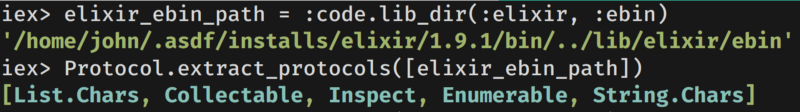
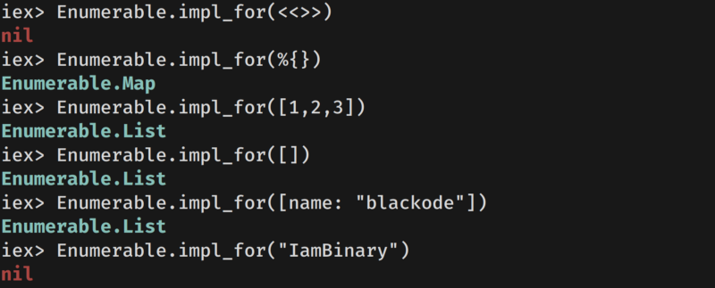
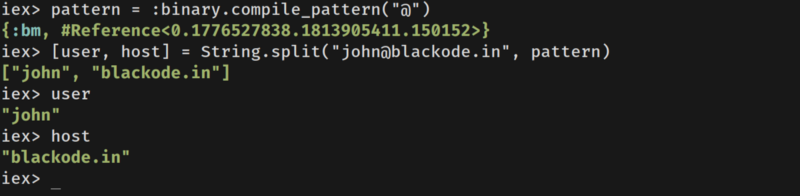
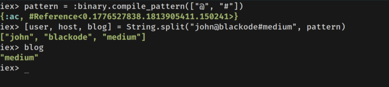
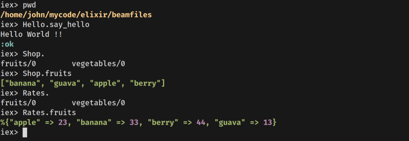
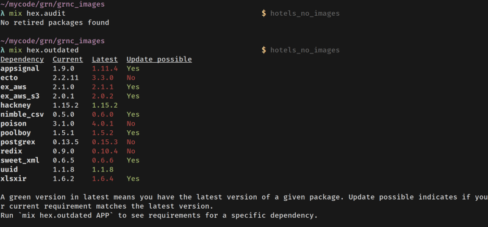
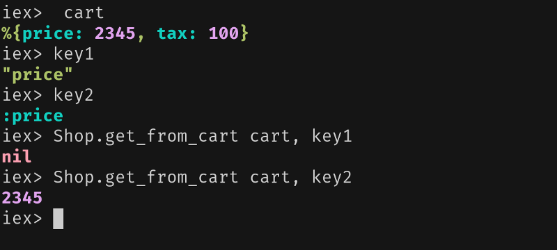
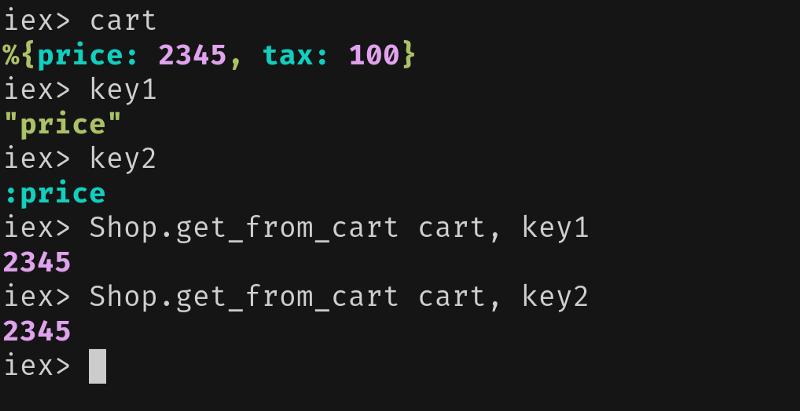

It is a great pleasure to come up with another set of tips that you may or may 
not know. I am using 👇

Erlang/OTP 22 [erts-10.6.3] [source] [64-bit] [smp:8:8] [ds:8:8:10] 
[async-threads:1] [hipe]

Elixir 1.10.0 (compiled with Erlang/OTP 21)

### 1. Elixir's Ebin Directory

```elixir
iex> elixir_ebin_path = :code.lib_dir(:elixir, :ebin)
```
### What this for ?

We can find all the protocols available for us by using `elixir_ebin_path` .

```elixir
iex> elixir_ebin_path = :code.lib_dir(:elixir, :ebin)
iex> Protocol.extract_protocols([elixir_ebin_path])
```




### 2. Finding Protocol implementations


We can easily find whether a protocol is implemented for particular type using 
the __protocol__ .

Let's check our Enumerable protocol is implemented for bitstring or not.

```elixir
iex> Enumerable.impl_for(<<>>)
nil
```

The output for the expression is nil which indicates the Enumerable protocol is 
not implemented for BitString type if it has implemented, it would give the 
**ModuleName**. Check below 👇

```elixir
iex> Enumerable.impl_for(%{})
Enumerable.Map
iex> Enumerable.impl_for(1..2)
Enumerable.Range
```


You can pass any valid structure to know the protocol implementations.

#### Listing All implementations of a  Protocol

```elixir
iex> Enumerable.__protocol__(:impls)
{:consolidated,[Map, HashSet, Date.Range, Function, File.Stream, 
GenEvent.Stream, HashDict,List, Range, Stream, MapSet, IO.Stream]}
```

In the same way you can get more info using the following functions

```elixir
def __protocol__(:module)
def __protocol__(:functions)
def __protocol__(:consolidated?)
def __protocol__(:impls)
```


### 3. Compile Time Search Patterns over Strings or Binaries


The Big string operations might be time taking ones. For an example splitting a 
big string.   

We can build compile time search patterns using ``:binary.compile_pattern``. 

This pattern can later be used in run time for splitting a string or any 
relevant operations over ``string`` or ``binary``.

In one sentence, it is ready by the time it is compiled.

```elixir
iex> pattern = :binary.compile_pattern("@")
{:bm, #Reference<0.1776527838.1813905411.150152>}

iex> [user, host] = String.split("john@blackode.in", pattern)
["john", "blackode.in"]
```



You can also give list of binaries for ``:binary.compile_pattern`` where each 
one is alternative for searching patterns.

```elixir
iex> pattern = :binary.compile_pattern(["@", "#"])
{:bm, #Reference<0.1776527838.1813905411.150152>}
iex> [user, host, blog] = String.split("john@blackode#medium", pattern)
["john", "blackode", ,"medium"]
```


Read more about [compile_pattern](http://Read more about compile_pattern)

### 4.Compiling Files to the specific Path

We can compile Elixir files to the specific path, and we can run those 
files from their compiled directory as it contains respective beam_files. 

Assume that I have three ``.ex`` files **hello.ex**, **shop.ex**, 
& **rates.ex** 
in my present code directory ``~/mycode/elixir`` .

Now, I run **iex** from my ~/mycode/elixir directory and I try to compile
files to some other directory named as ``~/mycode/elixir/beamfiles``

```elixir
#~/mycode/elixir
iex> files = ~w(hello.ex shop.ex rates.ex)
["hello.ex", "shop.ex", "rates.ex"]
iex> Kernel.ParallelCompiler.compile_to_path files, "beamfiles"
{:ok, [Hello, Rates, Shop], []}
```
Now, I change my directory to ``~/mycode/elxir/beamfiles`` and try 
to run ``iex`` and execute functions from compiled 
modules **[Hello, Rates, Shop].**



Check them live here
<br/>

<script id="asciicast-286903" src="https://asciinema.org/a/286903.js" async></script>


### 5. Finding Package Retirements

```elixir
mix hex.audit
```

I hope you haven't run this in any of your projects before. 
If you did, then a round of applause for you. 

### What it does ?

It looks for all the dependencies inside your dependency tree and 
checks for any of these has retired. 

### Who needs it?

Package Retirement is very important for package owners or 
package maintainers if they do care about their users to warn them 
about package security issues, it's working condition on that 
version number, it's compiling status, major bug issues, etc… like and  so.

If no retired packages found, then it replies with 
**No retired packages found.**

Similarly, you can also run ``mix hex.outdated`` It does what it sounds alike.




### 6. Finding a whether function is a Built-In or Not

This relates to [Erlang]()

```elixir
iex> :erlang.is_builtin(:erlang, :>, 2)
true
```
You have to provide a **Module**, **Function**, and **Arity**.

### 7. Number Comparison in Guard Clause

Always combine comparisons with `is_number()`

### Why?

```elixir
defmodule Bank do
   def credit(amount) when amount > 0 do
      #code
   end
end
```

The above function use the guard ``amount > 0`` what if we 
send ``nil`` , it still evaluates to ``true``.


At production grade coding, one has to be cautious. We can't risk on number 
especially on floats. The math on floats is harder.

So, go for

```elixir
defmodule Bank do
  def credit(amount) when is_number (amount) and amount > 0 do

      #code
 
  end
end
```
### 8. Empty map pattern matching function

As we all know that ``%{}`` matches any kind of map. So, we cannot 
simply pattern match it like ``def hello(%{})`` as it matches any map.

If you want to match an empty map ``%{}`` in a function, you have to use a 
guard clause.

```elixir
defmodule Hello do
  def hello(map) when map == %{} do
    IO.puts "I am hungry! My stomatch is empty"
  end
  def hello(map) do
    IO.puts "I am done! My stomach is full"
  end
end
```
You can also take the help of ``Kernel.map_size/1`` as it is allowed in guard 
clause.

```elixir
def hello(map) when map_size(map) == 0 do
```

### 9. Converting String to Atom

This may look easy but suppose you don't know whether the value you are 
getting is atom or string but you need to extract that key from a map 
which has keys as atoms where you have to convert the given value to atom 
if it is a binary.

As we are having doubt on the received value whether it is atom or 
string, we force convert that to an atom using ``String.to_atom/1``. 
It works for strings but if we try to convert **atom** to **atom** using 
``String.to_atom/1`` then we will get an exception.

So, we use same function with a different style with string interpolation.
```elixir
cart = %{ price: 2345, tax: 100}
key1 = "price"
key2 = :price
```
Now, we have to extract the price using above keys.

```elixir
def get_from_cart(cart, key) do
  Map.get(cart, key)
end
```
The above function works only when key is atom. Let's check that



### Sol 1: Using String Interpolation

```elixir
def get_from_cart(cart, key) do
  key = String.to_atom("#{key}")
  Map.get(cart, key)
end
```


### Sol: 2 Using Guard clause when

```elixir
def get_from_cart(cart, key) when is_binary(key) do
  key = String.to_atom(key) 
  Map.get(cart, key)
end
def get_from_cart(cart, key) do
  Map.get(cart, key)
end
```
In **Sol:1** we are converting every time, while in **Sol:2** we are using guard 
to convert to `atom` or not.


### 10. Sorting Dates Improvement(elixir v 1.10)

No more hassle to sort dates now.

Before elixir v 1.10, we have to pass another function for proper
sorting of dates like in the following way...

```elixir
iex> Enum.sort([~D[2019-12-31], ~D[2020-01-01]], &(Date.compare(&1, &2) != :lt))
[~D[2019-12-31], ~D[2020-01-01]]

```
Now in elixir v 1.10, you can do it as follows

```elixir
iex> Enum.sort([~D[2019-12-31], ~D[2020-01-01]], Date)
[~D[2019-12-31], ~D[2020-01-01]]

iex> Enum.sort([~D[2019-12-31], ~D[2020-01-01]], {:desc, Date})
[~D[2020-01-01], ~D[2019-12-31]]

```
The above examples are directly copied from original documentation.

Read More about [Elixir V 1.10](https://elixir-lang.org/blog/2020/01/27/elixir-v1-10-0-released/)


