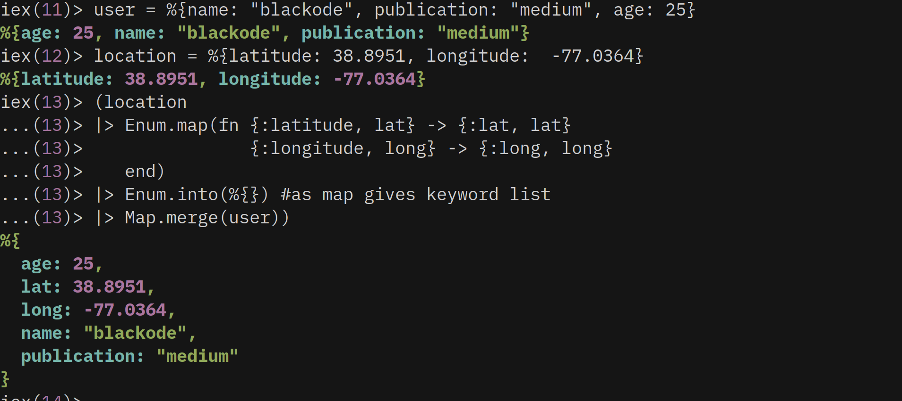
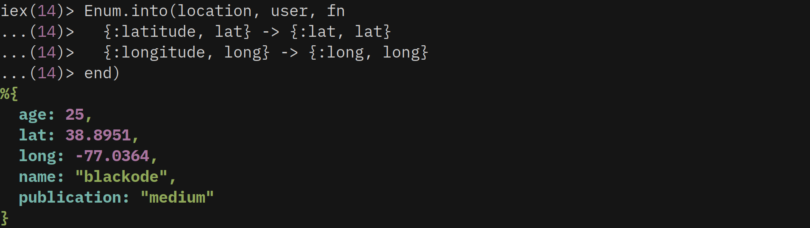
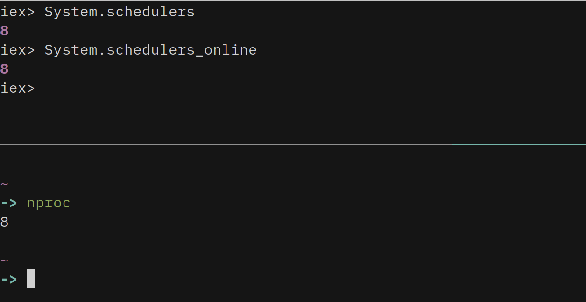
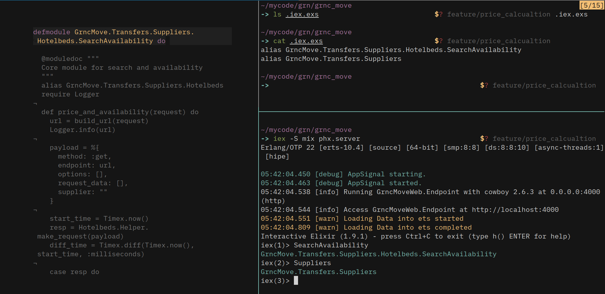

I am using the following development stack at the moment of writing this article.

```elixir
Erlang/OTP 22 [erts-10.4] [source] [64-bit] [smp:8:8] [ds:8:8:10] [async-threads:1] [hipe]Elixir 1.9.1 (compiled with Erlang/OTP 20)
```


## 1. Float to binary — Required Decimal Precision

The title of this tip may look odd, but it makes sense when you see the requirement. 
I just developed a fake story.       

I have a float number `3.4` and a friend of mine asked to convert that to a *binary* . 
I said that it is so simple just use `to_string` function from `Kernel` module.

```elixir
float = 3.4
to_string float
"3.4"
```


Again, he asked me to not use `to_string` then I have shown him this

```elixir
float = 3.4
float_string = inspect(float)
"3.4"
```


He said that he don’t want to use any function then I have shown him this

```elixir
float = 3.4
float_string = "#{float}"
```


He is still not convinced. He needs two **decimals** after a period. It’s like **"3.40"**

After thinking a while, I revisited modules in `Elixir`. I found `Float.to_string` but it is not going to solve our problem.

The `Erlang` is the place where you find more hidden treasures. If you need to convert a **float** to a **string** with an explicit **decimal** precision, use the built-in **Erlang** function `float_to_binary`

```
iex> :erlang.float_to_binary 3.4, decimals: 2  
"3.40"

iex> :erlang.float_to_binary 3.4, decimals: 5
"3.40000"
```

**NOTE**

The decimals option should be with in the range **0-253**


## 2. Inspecting Only Derived Elements in Structs

We can limit the keys to print while we **inspect** structs using `@derive` attribute.       

Don’t believe, check it down

```elixir
defmodule Address do  
  @derive {Inspect, only: [:name, :country]}  
  defstruct [name: "john", street: "2nd lane", door_no: "12-3", state: "mystate",    	country: "My Country"  ]
end

iex> %Address{}
#Address<country: "My Country", name: "john", ...>  #OUTPUT
```


## 3. Enumeration & Merging two maps

Let’s  consider we have a requirement to modify a map and need to merge the  modified map with some other map. **API** developers always face this  situation like modifying the response according to the client.

Consider the following two maps **user** and **location**

```elixir
user = %{name: "blackode", publication: "medium", age: 25}
location = %{latitude: 38.8951, longitude:  -77.0364}
```

Now, we have a requirement to modify the keys for **location** map from `latitude` to `lat` and `longitude` to `long`. After **map** modification, the **modified map** has to merge into **user** map.

Just to convey the idea, I am using a map with fewer number of key-value pairs.

Before, I was doing `Enum.map/2` followed by `Enum.into/2` followed by `Map.merge/2`

## #Don’t Do

```elixir
location
|> Enum.map(fn {:latitude, lat} -> {:lat, lat}
               {:longitude, long} -> {:long, long} 
   end)
|> Enum.into(%{}) #as map gives keyword list
|> Map.merge(user)
```



We can simply achieve this using alone `Enum.into/3`

## #Do

```elixir
Enum.into(location, user, fn 
  {:latitude, lat} -> {:lat, lat}
  {:longitude, long} -> {:long, long} 
end)
```




##  4. Finding System Cpu’s available count

```elixir
System.schedulers
```

You can also check **online** schedulers like

```elixir
System.schedulers_online
```

You can type in your terminal not iex print the number of processing units available using the command `nproc`

```bash
$ nproc
```




## 5. Finding Message Queue Length of a Process

We can know queue length of a process using `Process.info/2`

```elixir
Process.info(pid, :message_queue_len)
```

Let’s check that

```elixir
iex> send self, :hello
iex> send self, :hi
```

Above  lines will send two messages to the current process. As we did not  write any receive block here, they keep waiting inside mailbox queue.

Now we will check the messages queue length of the current process `self`

```elixir
iex> Process.info(self, :message_queue_len)
{:message_queue_len, 2}
```


Now we handle one message using receive block and will check the queue length once again.

```elixir
iex> receive do: (:hello -> "I GOT HELLO")
"I GOT HELLO"

iex> Process.info(self, :message_queue_len)
{:message_queue_len, 1}
```

Did you see that, we have only one message in queue as we handled `:hello` message.

Again, we handle the left over message `:hi` and this time the length will be `0` Of course it will be as there are no more messages to handle.

```elixir
iex> receive do: (:hi -> "I GOT HI")
"I GOT HI"

iex> Process.info(self, :message_queue_len)
{:message_queue_len, 0}
```


https://asciinema.org/a/271142?source=post_page-----7155532befd7----------------------


## 6. Loading project Module aliases (.iex.exs)

We always try to execute the project module functions in `iex` interactive shell to check its behavior.

Sometimes, our module names will be lengthy to type. Of course, we can type `alias` in `iex` but it vanishes every time you restart the `iex` shell and you have to type the aliases once again.

Create `.iex.exs` file in the project root directory and add all **aliases** to the file.

Whenever you start `iex` shell, it looks for `.iex.exs` file in the current working folder . So, it creates all the **aliases** in the `.iex.exs` file.

If file isn’t exist in the current directory, then it looks in your **home** directory i.e `~/.iex.exs`.




## 7. Float to a binary with out precision

Requirement `3.4 to “3”`

To meet our needs, we need to convert the float to integer using `trunc` function from `Kernel` module and then passing it to the `to_string` function.

Initially, I was doing like in the following which I don’t recommend you to do.

## #Don’t Do

```elixir
float = 3.4
float
|> Kernel.trunc()
|> to_string()
```

It is too much typing and have to use extra conversion here.

We can achieve this using `:erlang.float_to_binary` passing `decimals` option.

## #Do

```elixir
:erlang.float_to_binary(3.4, decimals: 0)
"3"
```


## 8. Finding N slowest tests in mix application

```elixir
mix test --slowest N  # N is integerexamplemix test --slowest 3
```

Replace `N` with any integer value then it prints timing information for the N slowest tests.

It automatically adds`--trace` and`--preload-modules`


## 9. Re-Designing Custom data type inspection across the app

It is simply implementing **Inspect** protocol for our custom type.

We can re design the inspect output for any specific type by implementing the Inspect protocol and overriding inspect function.


```elixir
defmodule Student do  
  defstruct name: "John", place: "Earth"
end

defimpl Inspect, for: Student do
  def inspect(student, _opts) do
    """
    -----------|---------------------
       Name    :     #{student.name} 
    -----------|---------------------
       Place   :     #{student.place}
    -----------|---------------------
    """
  end
end

iex> %Student{}
-----------|---------------------
   Name    :     John 
-----------|---------------------
   Place   :     Earth
-----------|---------------------
```


It is highly useful for custom structs where we can define what we need to see whenever we inspect our struct.


## 10. Writable Temporary Directory

It is trivial that we need a temporary directory to write certain files and to delete later based on our code logic.

In elixir, we can get the path based on the operating system the app is running using `System.tmp_dir/0` which returns a writable temporary directory.

We can customize the path with different environment variables like in the following;

```elixir
export TMP="~/tmp"
iex
iex> System.tmp_dir
```

It returns the directory set to **TMP** environment variable if available

```elixir
export TMPDIR="~/temp"
iex
iex> System.tmp_dir
```

It returns the directory set to **TMPDIR** environment variable if available

If three environment variables are set, then it searches for directories in the following order

```
1. TMPDIR
2. TEMP
3. TMP
```

If none of them was found then it returns default directories based on the operating system like `C:\TMP` on **Windows** or `/tmp`on **Unix**

In case the default directories are not found then it returns PWD i.e present working directory as a last piece of cake.

## WARNING

Though you exported **Environmental** variables, it still gives default values if those exported directories are not available.
